# Database Visualization & Relationships

> Understanding how data flows between Users, Organizations, Events, and Races.

---

## Live Schema Visualization
Every time you run `npx prisma generate`, a live Entity-Relationship Diagram (ERD) is updated. This is the "source of truth" for our database structure.

### How to use the ERD
- **View:** Open `docs/erd.svg` in any browser for a zoomable view.
- **Sync:** It updates automatically whenever you change `schema.prisma` and run the generate command.

---

## Relationship Map
Here is a high-level overview of how the models connect:

| From Model | Relation | To Model | Type |
|---|---|---|---|
| **User** | memberships | **OrgMembership** | 1:N |
| **Organization** | memberships | **OrgMembership** | 1:N |
| **Organization** | events | **Event** | 1:N |
| **Event** | races | **Race** | 1:N |
| **Race** | registrations | **Registration** | 1:N |
| **User** | registrations | **Registration** | 1:N |

### Core Constraints
- **Registration Uniqueness:** A User cannot register for the same Race twice (`@@unique([userId, raceId])`).
- **Soft Deletes:** `User` and `Organization` support `deletedAt` for safety.
- **Performance:** Foreign keys like `orgId` and `eventId` are indexed to ensure fast lookups even with millions of records.

---

## Best Practices
1. **Transactions:** When creating a `Registration`, always check `Race` capacity first. Use Prisma `$transaction` if you are performing multiple writes (e.g., creating a registration and updating a user's status).
2. **Include vs. Select:** 
   - Use `include` when you need the full related object.
   - Use `select` in public-facing APIs to avoid leaking sensitive fields (like hashed passwords).
